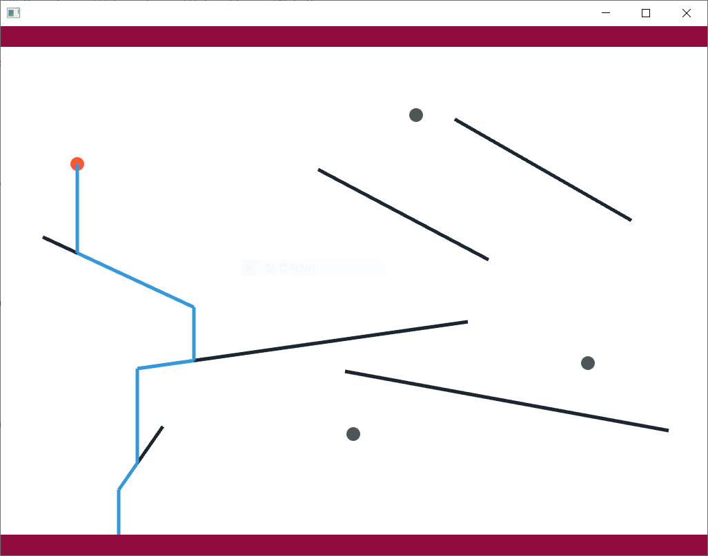

# Waterfall Project

The second project of this class. It draws on screen some lines and dots, water flowing out of a dot and along the lines.



This program is written in C++.

---

## Prerequisites

You need openFrameworks to run this program.

https://openframeworks.cc/download/

---

## How to run

**1. Press the L key on the initial screen to open the window to select input file.**

&nbsp;&nbsp;The input file consists of the number of dots, the coordinates of the dots, the number of lines, and the coordinates of the two points that form the lines.

*Example)*

```
6
171 673 235 581
198 497 677 429
499 501 968 587
61 306 280 408
460 208 707 339
658 135 914 282
4
111 200
511 592
602 129
851 489
```

**2. Press the D key to draw the dots and lines on the screen.**

**3. Press the S/E key to draw/erase the water flowing.**

&nbsp;&nbsp;The dot where water flows out can be set through the directional key while the water is not flowing out.

**4. Press the Q key to exit the program.**
